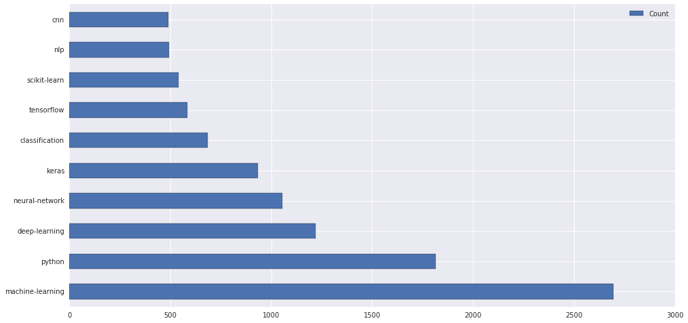
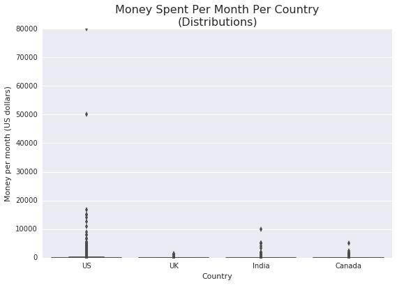

# Popular Data Science Questions in Python

In this project, I will use the Data Science Stack Exchange to help determine what content a data science course should focus on. To do this, I will use Stack Exchange's tagging system to determine popular topics. This data is available on the [Stack Exchange Data Explorer](https://data.stackexchange.com/datascience/query/new)

I will focus my attention on the columns that seem most relevant to my goal: 
- ID
- PostTypeId
- CreationDate
- Score
- ViewCount
- Tags
- AnswerCount
- FavoriteCount

## Exploring the Data


```python
import pandas as pd
import matplotlib.pyplot as plt
import seaborn as sns

%matplotlib inline
```


```python
questions = pd.read_csv("2019_questions.csv", parse_dates=["CreationDate"])
```


```python
questions.head()
```


<div>
<style scoped>
    .dataframe tbody tr th:only-of-type {
        vertical-align: middle;
    }

    .dataframe tbody tr th {
        vertical-align: top;
    }

    .dataframe thead th {
        text-align: right;
    }
</style>
<table border="1" class="dataframe">
  <thead>
    <tr style="text-align: right;">
      <th></th>
      <th>Id</th>
      <th>CreationDate</th>
      <th>Score</th>
      <th>ViewCount</th>
      <th>Tags</th>
      <th>AnswerCount</th>
      <th>FavoriteCount</th>
    </tr>
  </thead>
  <tbody>
    <tr>
      <th>0</th>
      <td>44419</td>
      <td>2019-01-23 09:21:13</td>
      <td>1</td>
      <td>21</td>
      <td>&lt;machine-learning&gt;&lt;data-mining&gt;</td>
      <td>0</td>
      <td>NaN</td>
    </tr>
    <tr>
      <th>1</th>
      <td>44420</td>
      <td>2019-01-23 09:34:01</td>
      <td>0</td>
      <td>25</td>
      <td>&lt;machine-learning&gt;&lt;regression&gt;&lt;linear-regressi...</td>
      <td>0</td>
      <td>NaN</td>
    </tr>
    <tr>
      <th>2</th>
      <td>44423</td>
      <td>2019-01-23 09:58:41</td>
      <td>2</td>
      <td>1651</td>
      <td>&lt;python&gt;&lt;time-series&gt;&lt;forecast&gt;&lt;forecasting&gt;</td>
      <td>0</td>
      <td>NaN</td>
    </tr>
    <tr>
      <th>3</th>
      <td>44427</td>
      <td>2019-01-23 10:57:09</td>
      <td>0</td>
      <td>55</td>
      <td>&lt;machine-learning&gt;&lt;scikit-learn&gt;&lt;pca&gt;</td>
      <td>1</td>
      <td>NaN</td>
    </tr>
    <tr>
      <th>4</th>
      <td>44428</td>
      <td>2019-01-23 11:02:15</td>
      <td>0</td>
      <td>19</td>
      <td>&lt;dataset&gt;&lt;bigdata&gt;&lt;data&gt;&lt;speech-to-text&gt;</td>
      <td>0</td>
      <td>NaN</td>
    </tr>
  </tbody>
</table>
</div>


```python
questions.info()
```

    <class 'pandas.core.frame.DataFrame'>
    RangeIndex: 8839 entries, 0 to 8838
    Data columns (total 7 columns):
    Id               8839 non-null int64
    CreationDate     8839 non-null datetime64[ns]
    Score            8839 non-null int64
    ViewCount        8839 non-null int64
    Tags             8839 non-null object
    AnswerCount      8839 non-null int64
    FavoriteCount    1407 non-null float64
    dtypes: datetime64[ns](1), float64(1), int64(4), object(1)
    memory usage: 483.5+ KB


FavoriteCount has a number of missing values. I will replace these with zeroes since they have not been favorited. 


```python
questions.fillna(value={"FavoriteCount": 0}, inplace=True)
questions["FavoriteCount"] = questions["FavoriteCount"].astype(int)
print(questions.dtypes)
print('\n')
print(questions.info())
```

    Id                        int64
    CreationDate     datetime64[ns]
    Score                     int64
    ViewCount                 int64
    Tags                     object
    AnswerCount               int64
    FavoriteCount             int64
    dtype: object
    
    
    <class 'pandas.core.frame.DataFrame'>
    RangeIndex: 8839 entries, 0 to 8838
    Data columns (total 7 columns):
    Id               8839 non-null int64
    CreationDate     8839 non-null datetime64[ns]
    Score            8839 non-null int64
    ViewCount        8839 non-null int64
    Tags             8839 non-null object
    AnswerCount      8839 non-null int64
    FavoriteCount    8839 non-null int64
    dtypes: datetime64[ns](1), int64(5), object(1)
    memory usage: 483.5+ KB
    None


## Tags Column Manipulation

I will now explore the tags column in more detail


```python
questions["Tags"].apply(lambda value: type(value)).unique()
```


    array([<class 'str'>], dtype=object)


It looks like we have a columns of strings. Stack Exchange only allows al maximum of 5 tags, so I will break this into 5 columns: Tag1, Tag2, etc.

Also, the tags are separated by <>. I wish to change this separation to commas. 


```python
questions["Tags"] = questions["Tags"].str.replace("><",",").str.replace("<|>", "").str.split(",")
```


```python
questions.head()
```


<div>
<style scoped>
    .dataframe tbody tr th:only-of-type {
        vertical-align: middle;
    }

    .dataframe tbody tr th {
        vertical-align: top;
    }

    .dataframe thead th {
        text-align: right;
    }
</style>
<table border="1" class="dataframe">
  <thead>
    <tr style="text-align: right;">
      <th></th>
      <th>Id</th>
      <th>CreationDate</th>
      <th>Score</th>
      <th>ViewCount</th>
      <th>Tags</th>
      <th>AnswerCount</th>
      <th>FavoriteCount</th>
    </tr>
  </thead>
  <tbody>
    <tr>
      <th>0</th>
      <td>44419</td>
      <td>2019-01-23 09:21:13</td>
      <td>1</td>
      <td>21</td>
      <td>[machine-learning, data-mining]</td>
      <td>0</td>
      <td>0</td>
    </tr>
    <tr>
      <th>1</th>
      <td>44420</td>
      <td>2019-01-23 09:34:01</td>
      <td>0</td>
      <td>25</td>
      <td>[machine-learning, regression, linear-regressi...</td>
      <td>0</td>
      <td>0</td>
    </tr>
    <tr>
      <th>2</th>
      <td>44423</td>
      <td>2019-01-23 09:58:41</td>
      <td>2</td>
      <td>1651</td>
      <td>[python, time-series, forecast, forecasting]</td>
      <td>0</td>
      <td>0</td>
    </tr>
    <tr>
      <th>3</th>
      <td>44427</td>
      <td>2019-01-23 10:57:09</td>
      <td>0</td>
      <td>55</td>
      <td>[machine-learning, scikit-learn, pca]</td>
      <td>1</td>
      <td>0</td>
    </tr>
    <tr>
      <th>4</th>
      <td>44428</td>
      <td>2019-01-23 11:02:15</td>
      <td>0</td>
      <td>19</td>
      <td>[dataset, bigdata, data, speech-to-text]</td>
      <td>0</td>
      <td>0</td>
    </tr>
  </tbody>
</table>
</div>


## Determining The Most Popular Tags

For each tag, I'll count how many times the tage was used and how many times a question with that tag was viewed. 


```python
#count how many times a tage was used

tag_count = dict()

for tags in questions["Tags"]:
    for tag in tags:
        if tag in tag_count:
            tag_count[tag] += 1
        else:
            tag_count[tag] = 1

tag_count = pd.DataFrame.from_dict(tag_count, orient="index")
tag_count.rename(columns={0: "Count"}, inplace=True)
tag_count.head(10)

most_used = tag_count.sort_values(by="Count", ascending = False).head(10)
most_used
```


<div>
<style scoped>
    .dataframe tbody tr th:only-of-type {
        vertical-align: middle;
    }

    .dataframe tbody tr th {
        vertical-align: top;
    }

    .dataframe thead th {
        text-align: right;
    }
</style>
<table border="1" class="dataframe">
  <thead>
    <tr style="text-align: right;">
      <th></th>
      <th>Count</th>
    </tr>
  </thead>
  <tbody>
    <tr>
      <th>machine-learning</th>
      <td>2693</td>
    </tr>
    <tr>
      <th>python</th>
      <td>1814</td>
    </tr>
    <tr>
      <th>deep-learning</th>
      <td>1220</td>
    </tr>
    <tr>
      <th>neural-network</th>
      <td>1055</td>
    </tr>
    <tr>
      <th>keras</th>
      <td>935</td>
    </tr>
    <tr>
      <th>classification</th>
      <td>685</td>
    </tr>
    <tr>
      <th>tensorflow</th>
      <td>584</td>
    </tr>
    <tr>
      <th>scikit-learn</th>
      <td>540</td>
    </tr>
    <tr>
      <th>nlp</th>
      <td>493</td>
    </tr>
    <tr>
      <th>cnn</th>
      <td>489</td>
    </tr>
  </tbody>
</table>
</div>


```python
most_used.plot(kind="barh", figsize=(16,8))
```


    <matplotlib.axes._subplots.AxesSubplot at 0x7f6b5c427ef0>





I will now repeat this process for views


```python
#count how many times a tage was viewed

tag_view_count = dict()

for index, row in questions.iterrows():
    for tag in row['Tags']:
        if tag in tag_view_count:
            tag_view_count[tag] += row['ViewCount']
        else:
            tag_view_count[tag] = row['ViewCount']
            
tag_view_count = pd.DataFrame.from_dict(tag_view_count, orient="index")
tag_view_count.rename(columns={0: "ViewCount"}, inplace=True)

most_viewed = tag_view_count.sort_values(by="ViewCount", ascending = False).head(10)

most_viewed.plot(kind="barh", figsize=(16,8))
```


    <matplotlib.axes._subplots.AxesSubplot at 0x7f6b5bf20438>





It looks like for both views and tag counts, machine learning and python are the most popular. 


```python

```
