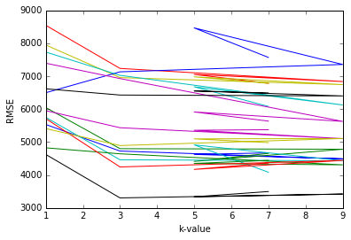
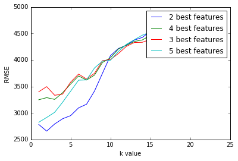

# K-Nearest Neighbors and A Car's Market Price

In this project, I will practice the machine learning workflow to predict a car's market price using its attributes. The dataset found at the (UCI Machine Learning Repository)[https://archive.ics.uci.edu/ml/datasets/automobile] contains information about the technical aspects of different vehicles. 

## Exploring the data


```python
import pandas as pd

cols = ['symboling', 'normalized-losses', 'make', 'fuel-type', 'aspiration', 'num-of-doors', 'body-style', 
        'drive-wheels', 'engine-location', 'wheel-base', 'length', 'width', 'height', 'curb-weight', 'engine-type', 
        'num-of-cylinders', 'engine-size', 'fuel-system', 'bore', 'stroke', 'compression-rate', 'horsepower', 'peak-rpm', 'city-mpg', 'highway-mpg', 'price']
cars = pd.read_csv('imports-85.data', names=cols)

print(cars.shape)
cars.head()
```

    (205, 26)


<div>
<style scoped>
    .dataframe tbody tr th:only-of-type {
        vertical-align: middle;
    }

    .dataframe tbody tr th {
        vertical-align: top;
    }

    .dataframe thead th {
        text-align: right;
    }
</style>
<table border="1" class="dataframe">
  <thead>
    <tr style="text-align: right;">
      <th></th>
      <th>symboling</th>
      <th>normalized-losses</th>
      <th>make</th>
      <th>fuel-type</th>
      <th>aspiration</th>
      <th>num-of-doors</th>
      <th>body-style</th>
      <th>drive-wheels</th>
      <th>engine-location</th>
      <th>wheel-base</th>
      <th>...</th>
      <th>engine-size</th>
      <th>fuel-system</th>
      <th>bore</th>
      <th>stroke</th>
      <th>compression-rate</th>
      <th>horsepower</th>
      <th>peak-rpm</th>
      <th>city-mpg</th>
      <th>highway-mpg</th>
      <th>price</th>
    </tr>
  </thead>
  <tbody>
    <tr>
      <th>0</th>
      <td>3</td>
      <td>?</td>
      <td>alfa-romero</td>
      <td>gas</td>
      <td>std</td>
      <td>two</td>
      <td>convertible</td>
      <td>rwd</td>
      <td>front</td>
      <td>88.6</td>
      <td>...</td>
      <td>130</td>
      <td>mpfi</td>
      <td>3.47</td>
      <td>2.68</td>
      <td>9.0</td>
      <td>111</td>
      <td>5000</td>
      <td>21</td>
      <td>27</td>
      <td>13495</td>
    </tr>
    <tr>
      <th>1</th>
      <td>3</td>
      <td>?</td>
      <td>alfa-romero</td>
      <td>gas</td>
      <td>std</td>
      <td>two</td>
      <td>convertible</td>
      <td>rwd</td>
      <td>front</td>
      <td>88.6</td>
      <td>...</td>
      <td>130</td>
      <td>mpfi</td>
      <td>3.47</td>
      <td>2.68</td>
      <td>9.0</td>
      <td>111</td>
      <td>5000</td>
      <td>21</td>
      <td>27</td>
      <td>16500</td>
    </tr>
    <tr>
      <th>2</th>
      <td>1</td>
      <td>?</td>
      <td>alfa-romero</td>
      <td>gas</td>
      <td>std</td>
      <td>two</td>
      <td>hatchback</td>
      <td>rwd</td>
      <td>front</td>
      <td>94.5</td>
      <td>...</td>
      <td>152</td>
      <td>mpfi</td>
      <td>2.68</td>
      <td>3.47</td>
      <td>9.0</td>
      <td>154</td>
      <td>5000</td>
      <td>19</td>
      <td>26</td>
      <td>16500</td>
    </tr>
    <tr>
      <th>3</th>
      <td>2</td>
      <td>164</td>
      <td>audi</td>
      <td>gas</td>
      <td>std</td>
      <td>four</td>
      <td>sedan</td>
      <td>fwd</td>
      <td>front</td>
      <td>99.8</td>
      <td>...</td>
      <td>109</td>
      <td>mpfi</td>
      <td>3.19</td>
      <td>3.40</td>
      <td>10.0</td>
      <td>102</td>
      <td>5500</td>
      <td>24</td>
      <td>30</td>
      <td>13950</td>
    </tr>
    <tr>
      <th>4</th>
      <td>2</td>
      <td>164</td>
      <td>audi</td>
      <td>gas</td>
      <td>std</td>
      <td>four</td>
      <td>sedan</td>
      <td>4wd</td>
      <td>front</td>
      <td>99.4</td>
      <td>...</td>
      <td>136</td>
      <td>mpfi</td>
      <td>3.19</td>
      <td>3.40</td>
      <td>8.0</td>
      <td>115</td>
      <td>5500</td>
      <td>18</td>
      <td>22</td>
      <td>17450</td>
    </tr>
  </tbody>
</table>
<p>5 rows × 26 columns</p>
</div>


```python
# Select only the columns with continuous values from - https://archive.ics.uci.edu/ml/machine-learning-databases/autos/imports-85.names
continuous_values_cols = ['normalized-losses', 'wheel-base', 'length', 'width', 'height', 'curb-weight', 'engine-size', 'bore', 'stroke', 'compression-rate', 'horsepower', 'peak-rpm', 'city-mpg', 'highway-mpg', 'price']
numeric_cars = cars[continuous_values_cols]

numeric_cars.head()
```


<div>
<style scoped>
    .dataframe tbody tr th:only-of-type {
        vertical-align: middle;
    }

    .dataframe tbody tr th {
        vertical-align: top;
    }

    .dataframe thead th {
        text-align: right;
    }
</style>
<table border="1" class="dataframe">
  <thead>
    <tr style="text-align: right;">
      <th></th>
      <th>normalized-losses</th>
      <th>wheel-base</th>
      <th>length</th>
      <th>width</th>
      <th>height</th>
      <th>curb-weight</th>
      <th>engine-size</th>
      <th>bore</th>
      <th>stroke</th>
      <th>compression-rate</th>
      <th>horsepower</th>
      <th>peak-rpm</th>
      <th>city-mpg</th>
      <th>highway-mpg</th>
      <th>price</th>
    </tr>
  </thead>
  <tbody>
    <tr>
      <th>0</th>
      <td>?</td>
      <td>88.6</td>
      <td>168.8</td>
      <td>64.1</td>
      <td>48.8</td>
      <td>2548</td>
      <td>130</td>
      <td>3.47</td>
      <td>2.68</td>
      <td>9.0</td>
      <td>111</td>
      <td>5000</td>
      <td>21</td>
      <td>27</td>
      <td>13495</td>
    </tr>
    <tr>
      <th>1</th>
      <td>?</td>
      <td>88.6</td>
      <td>168.8</td>
      <td>64.1</td>
      <td>48.8</td>
      <td>2548</td>
      <td>130</td>
      <td>3.47</td>
      <td>2.68</td>
      <td>9.0</td>
      <td>111</td>
      <td>5000</td>
      <td>21</td>
      <td>27</td>
      <td>16500</td>
    </tr>
    <tr>
      <th>2</th>
      <td>?</td>
      <td>94.5</td>
      <td>171.2</td>
      <td>65.5</td>
      <td>52.4</td>
      <td>2823</td>
      <td>152</td>
      <td>2.68</td>
      <td>3.47</td>
      <td>9.0</td>
      <td>154</td>
      <td>5000</td>
      <td>19</td>
      <td>26</td>
      <td>16500</td>
    </tr>
    <tr>
      <th>3</th>
      <td>164</td>
      <td>99.8</td>
      <td>176.6</td>
      <td>66.2</td>
      <td>54.3</td>
      <td>2337</td>
      <td>109</td>
      <td>3.19</td>
      <td>3.40</td>
      <td>10.0</td>
      <td>102</td>
      <td>5500</td>
      <td>24</td>
      <td>30</td>
      <td>13950</td>
    </tr>
    <tr>
      <th>4</th>
      <td>164</td>
      <td>99.4</td>
      <td>176.6</td>
      <td>66.4</td>
      <td>54.3</td>
      <td>2824</td>
      <td>136</td>
      <td>3.19</td>
      <td>3.40</td>
      <td>8.0</td>
      <td>115</td>
      <td>5500</td>
      <td>18</td>
      <td>22</td>
      <td>17450</td>
    </tr>
  </tbody>
</table>
</div>


## Data Cleaning

In order to prepare the data for predictive modeling, I need to make sure that there are no missing data values. First I will replace all of the ? values with the numpy.nan missing value. Then, I will change columns from the pandas object data type to a numeric type. 


```python
import numpy as np

numeric_cars = numeric_cars.replace("?", np.nan)

numeric_cars = numeric_cars.astype('float')
numeric_cars.isnull().sum()
```


    normalized-losses    41
    wheel-base            0
    length                0
    width                 0
    height                0
    curb-weight           0
    engine-size           0
    bore                  4
    stroke                4
    compression-rate      0
    horsepower            2
    peak-rpm              2
    city-mpg              0
    highway-mpg           0
    price                 4
    dtype: int64


Since I want to predict price, I will remove any rows with a missing price value


```python
numeric_cars = numeric_cars.dropna(subset=['price'])
numeric_cars.isnull().sum()
```


    normalized-losses    37
    wheel-base            0
    length                0
    width                 0
    height                0
    curb-weight           0
    engine-size           0
    bore                  4
    stroke                4
    compression-rate      0
    horsepower            2
    peak-rpm              2
    city-mpg              0
    highway-mpg           0
    price                 0
    dtype: int64


For the remaining missing values, I will replace them with the mean of each column. 


```python
numeric_cars = numeric_cars.fillna(numeric_cars.mean())
numeric_cars.isnull().sum()
```


    normalized-losses    0
    wheel-base           0
    length               0
    width                0
    height               0
    curb-weight          0
    engine-size          0
    bore                 0
    stroke               0
    compression-rate     0
    horsepower           0
    peak-rpm             0
    city-mpg             0
    highway-mpg          0
    price                0
    dtype: int64


I will now normalize all of the columns, except for price, so that the values range from 0 to 1


```python
price_col = numeric_cars['price']
numeric_cars = (numeric_cars - numeric_cars.min())/(numeric_cars.max() - numeric_cars.min())
numeric_cars['price'] = price_col

numeric_cars.head(2)
```


<div>
<style scoped>
    .dataframe tbody tr th:only-of-type {
        vertical-align: middle;
    }

    .dataframe tbody tr th {
        vertical-align: top;
    }

    .dataframe thead th {
        text-align: right;
    }
</style>
<table border="1" class="dataframe">
  <thead>
    <tr style="text-align: right;">
      <th></th>
      <th>normalized-losses</th>
      <th>wheel-base</th>
      <th>length</th>
      <th>width</th>
      <th>height</th>
      <th>curb-weight</th>
      <th>engine-size</th>
      <th>bore</th>
      <th>stroke</th>
      <th>compression-rate</th>
      <th>horsepower</th>
      <th>peak-rpm</th>
      <th>city-mpg</th>
      <th>highway-mpg</th>
      <th>price</th>
    </tr>
  </thead>
  <tbody>
    <tr>
      <th>0</th>
      <td>0.298429</td>
      <td>0.058309</td>
      <td>0.413433</td>
      <td>0.324786</td>
      <td>0.083333</td>
      <td>0.411171</td>
      <td>0.260377</td>
      <td>0.664286</td>
      <td>0.290476</td>
      <td>0.125</td>
      <td>0.294393</td>
      <td>0.346939</td>
      <td>0.222222</td>
      <td>0.289474</td>
      <td>13495.0</td>
    </tr>
    <tr>
      <th>1</th>
      <td>0.298429</td>
      <td>0.058309</td>
      <td>0.413433</td>
      <td>0.324786</td>
      <td>0.083333</td>
      <td>0.411171</td>
      <td>0.260377</td>
      <td>0.664286</td>
      <td>0.290476</td>
      <td>0.125</td>
      <td>0.294393</td>
      <td>0.346939</td>
      <td>0.222222</td>
      <td>0.289474</td>
      <td>16500.0</td>
    </tr>
  </tbody>
</table>
</div>


## Univariate Model

I will start with simple univariate models before moving to more complex models. 


```python
from sklearn.neighbors import KNeighborsRegressor
from sklearn.metrics import mean_squared_error

def knn_train_test(train_name, target_name, df):
    # randomizing the data
    np.random.seed(42)
    shuf = np.random.permutation(len(df))
    shuf_df = df.iloc[shuf]
    
    # Divide number of rows in half and round.
    last_train_row = int(len(shuf_df) / 2)
    
    # creating a training set and test set
    train_df = shuf_df.iloc[:last_train_row]
    test_df = shuf_df.iloc[last_train_row:]
    
    # Fit a model on the training set
    knn = KNeighborsRegressor()
    train_features = train_df[[train_name]]
    train_target = train_df[target_name]
    knn.fit(train_features, train_target)
    
    predictions = knn.predict(test_df[[train_name]])
    
    # Calculate RMSE and return it
    mse = mean_squared_error(test_df[target_name], predictions)
    rmse = mse ** (1/2)
    return rmse
```

I will use this function to train and test univariate models using the different numeric columns in the data set, trying to find the one with the best results


```python
rmse_results = {}
train_cols = numeric_cars.columns.drop('price')

for col in train_cols:
    rmse_val = knn_train_test(col, 'price', numeric_cars)
    rmse_results[col] = rmse_val

rmse_results_series = pd.Series(rmse_results)
rmse_results_series.sort_values()
```


    engine-size          3337.801438
    width                4169.982920
    horsepower           4350.979936
    city-mpg             4413.500971
    curb-weight          4625.061230
    highway-mpg          4914.877070
    wheel-base           5096.723829
    length               5357.692657
    compression-rate     5914.076632
    stroke               6551.795999
    bore                 6676.712709
    peak-rpm             6979.403412
    height               7053.377644
    normalized-losses    8464.431929
    dtype: float64


It looks like engine size offers the best results. 

I will now modify the knn_train_test function to accept a paramter for the k-value. For each numeric column, I will create, train, and test a univariate model using the following k-values (1, 3, 5, 7, 9). I will visualize the results using a scatter plot. 


```python
def knn_train_test_mod(train_name, target_name, df):
    # randomizing the data
    np.random.seed(42)
    shuf = np.random.permutation(len(df))
    shuf_df = df.iloc[shuf]
    
    # Divide number of rows in half and round.
    last_train_row = int(len(shuf_df) / 2)
    
    # creating a training set and test set
    train_df = shuf_df.iloc[:last_train_row]
    test_df = shuf_df.iloc[last_train_row:]
    
    k_values = [1,3,5,7,9]
    k_rmses = {}
    
    # Fit a model on the training set
    for k in k_values:
        knn = KNeighborsRegressor(n_neighbors=k)
        train_features = train_df[[train_name]]
        train_target = train_df[target_name]
        knn.fit(train_features, train_target)
    
        predictions = knn.predict(test_df[[train_name]])

        # Calculate RMSE and return it
        mse = mean_squared_error(test_df[target_name], predictions)
        rmse = mse ** (1/2)
        
        k_rmses[k] = rmse
    return k_rmses
```


```python
k_rmse_results = {}

train_cols = numeric_cars.columns.drop('price')
for col in train_cols:
    rmse_val = knn_train_test_mod(col, 'price', numeric_cars)
    k_rmse_results[col] = rmse_val

k_rmse_results
```


    {'bore': {1: 7731.580273446851,
      3: 7025.271360030743,
      5: 6676.712709051358,
      7: 6082.465304416473,
      9: 6126.419751535827},
     'city-mpg': {1: 6046.89262397974,
      3: 4798.817087923266,
      5: 4413.5009712211795,
      7: 4655.9360382636805,
      9: 4782.064381423028},
     'compression-rate': {1: 7393.18100858775,
      3: 6927.310859386509,
      5: 5914.0766316266545,
      7: 5636.040602485329,
      9: 5627.959479776104},
     'curb-weight': {1: 5532.6991300238205,
      3: 4726.845221738811,
      5: 4625.061229971999,
      7: 4670.85639182118,
      9: 4490.286543488664},
     'engine-size': {1: 4622.929733062323,
      3: 3304.5974848464807,
      5: 3337.801438250652,
      7: 3498.222024051865,
      9: 3421.655947820241},
     'height': {1: 8542.804440748441,
      3: 7235.331579092,
      5: 7053.377643637294,
      7: 6783.266165386619,
      9: 6836.805977677643},
     'highway-mpg': {1: 5749.036865526966,
      3: 4461.998624369172,
      5: 4914.877070267535,
      7: 4083.7289788131707,
      9: 4431.280665867321},
     'horsepower': {1: 4824.7711031736835,
      3: 4643.101799102803,
      5: 4350.979936328899,
      7: 4444.203474565274,
      9: 4308.984340346224},
     'length': {1: 5953.280443554122,
      3: 5435.344936189196,
      5: 5357.692656617425,
      7: 5374.619016003394,
      9: 5104.990254241936},
     'normalized-losses': {1: 6497.876243301909,
      3: 7131.969678269052,
      5: 8464.43192919409,
      7: 7568.65746299033,
      9: 7355.7644918959395},
     'peak-rpm': {1: 7945.809911425949,
      3: 6956.251346952624,
      5: 6979.403411509759,
      7: 6782.729728197261,
      9: 6744.200232564432},
     'stroke': {1: 6616.27767234899,
      3: 6427.081842562851,
      5: 6551.795999133172,
      7: 6490.015098346304,
      9: 6400.363000024806},
     'wheel-base': {1: 5408.802191660817,
      3: 4893.83133431393,
      5: 5096.72382882639,
      7: 4983.350325733043,
      9: 5107.565699123146},
     'width': {1: 5710.846686025386,
      3: 4244.069537062694,
      5: 4169.982919973569,
      7: 4363.201040226987,
      9: 4442.988853637933}}


```python
import matplotlib.pyplot as plt
%matplotlib inline

for k,v in k_rmse_results.items():
    x = list(v.keys())
    y = list(v.values())
    
    plt.plot(x,y)
    plt.xlabel('k-value')
    plt.ylabel('RMSE')
```





## Multivariate Model

I will now modeify the kmm_train_test function to work with multiple columns. 


```python
# Compute average RMSE across different `k` values for each feature.
feature_avg_rmse = {}
for k,v in k_rmse_results.items():
    avg_rmse = np.mean(list(v.values()))
    feature_avg_rmse[k] = avg_rmse
series_avg_rmse = pd.Series(feature_avg_rmse)
sorted_series_avg_rmse = series_avg_rmse.sort_values()
print(sorted_series_avg_rmse)

sorted_features = sorted_series_avg_rmse.index
```

    engine-size          3637.041326
    horsepower           4514.408131
    width                4586.217807
    highway-mpg          4728.184441
    curb-weight          4809.149703
    city-mpg             4939.442221
    wheel-base           5098.054676
    length               5445.185461
    compression-rate     6299.713716
    stroke               6497.106722
    bore                 6728.489880
    peak-rpm             7081.678926
    height               7290.317161
    normalized-losses    7403.739961
    dtype: float64


```python
def knn_train_test(train_cols, target_col, df):
    np.random.seed(1)
    
    # Randomize order of rows in data frame.
    shuffled_index = np.random.permutation(df.index)
    rand_df = df.reindex(shuffled_index)

    # Divide number of rows in half and round.
    last_train_row = int(len(rand_df) / 2)
    
    # Select the first half and set as training set.
    # Select the second half and set as test set.
    train_df = rand_df.iloc[0:last_train_row]
    test_df = rand_df.iloc[last_train_row:]
    
    k_values = [5]
    k_rmses = {}
    
    for k in k_values:
        # Fit model using k nearest neighbors.
        knn = KNeighborsRegressor(n_neighbors=k)
        knn.fit(train_df[train_cols], train_df[target_col])

        # Make predictions using model.
        predicted_labels = knn.predict(test_df[train_cols])

        # Calculate and return RMSE.
        mse = mean_squared_error(test_df[target_col], predicted_labels)
        rmse = np.sqrt(mse)
        
        k_rmses[k] = rmse
    return k_rmses
```


```python
for nr_best_feats in range(2,7):
    k_rmse_results['{} best features'.format(nr_best_feats)] = knn_train_test(
        sorted_features[:nr_best_feats],
        'price',
        numeric_cars
    )

k_rmse_results
```


    {'2 best features': {5: 2949.8817277180374},
     '3 best features': {5: 3580.7376651928435},
     '4 best features': {5: 3546.5585085619928},
     '5 best features': {5: 3410.2170133901805},
     '6 best features': {5: 3416.5360733634966},
     'bore': {1: 7731.580273446851,
      3: 7025.271360030743,
      5: 6676.712709051358,
      7: 6082.465304416473,
      9: 6126.419751535827},
     'city-mpg': {1: 6046.89262397974,
      3: 4798.817087923266,
      5: 4413.5009712211795,
      7: 4655.9360382636805,
      9: 4782.064381423028},
     'compression-rate': {1: 7393.18100858775,
      3: 6927.310859386509,
      5: 5914.0766316266545,
      7: 5636.040602485329,
      9: 5627.959479776104},
     'curb-weight': {1: 5532.6991300238205,
      3: 4726.845221738811,
      5: 4625.061229971999,
      7: 4670.85639182118,
      9: 4490.286543488664},
     'engine-size': {1: 4622.929733062323,
      3: 3304.5974848464807,
      5: 3337.801438250652,
      7: 3498.222024051865,
      9: 3421.655947820241},
     'height': {1: 8542.804440748441,
      3: 7235.331579092,
      5: 7053.377643637294,
      7: 6783.266165386619,
      9: 6836.805977677643},
     'highway-mpg': {1: 5749.036865526966,
      3: 4461.998624369172,
      5: 4914.877070267535,
      7: 4083.7289788131707,
      9: 4431.280665867321},
     'horsepower': {1: 4824.7711031736835,
      3: 4643.101799102803,
      5: 4350.979936328899,
      7: 4444.203474565274,
      9: 4308.984340346224},
     'length': {1: 5953.280443554122,
      3: 5435.344936189196,
      5: 5357.692656617425,
      7: 5374.619016003394,
      9: 5104.990254241936},
     'normalized-losses': {1: 6497.876243301909,
      3: 7131.969678269052,
      5: 8464.43192919409,
      7: 7568.65746299033,
      9: 7355.7644918959395},
     'peak-rpm': {1: 7945.809911425949,
      3: 6956.251346952624,
      5: 6979.403411509759,
      7: 6782.729728197261,
      9: 6744.200232564432},
     'stroke': {1: 6616.27767234899,
      3: 6427.081842562851,
      5: 6551.795999133172,
      7: 6490.015098346304,
      9: 6400.363000024806},
     'wheel-base': {1: 5408.802191660817,
      3: 4893.83133431393,
      5: 5096.72382882639,
      7: 4983.350325733043,
      9: 5107.565699123146},
     'width': {1: 5710.846686025386,
      3: 4244.069537062694,
      5: 4169.982919973569,
      7: 4363.201040226987,
      9: 4442.988853637933}}


## Hyperparameter Tuning


```python
def knn_train_test(train_cols, target_col, df):
    np.random.seed(1)
    
    # Randomize order of rows in data frame.
    shuffled_index = np.random.permutation(df.index)
    rand_df = df.reindex(shuffled_index)

    # Divide number of rows in half and round.
    last_train_row = int(len(rand_df) / 2)
    
    # Select the first half and set as training set.
    # Select the second half and set as test set.
    train_df = rand_df.iloc[0:last_train_row]
    test_df = rand_df.iloc[last_train_row:]
    
    k_values = [i for i in range(1, 25)]
    k_rmses = {}
    
    for k in k_values:
        # Fit model using k nearest neighbors.
        knn = KNeighborsRegressor(n_neighbors=k)
        knn.fit(train_df[train_cols], train_df[target_col])

        # Make predictions using model.
        predicted_labels = knn.predict(test_df[train_cols])

        # Calculate and return RMSE.
        mse = mean_squared_error(test_df[target_col], predicted_labels)
        rmse = np.sqrt(mse)
        
        k_rmses[k] = rmse
    return k_rmses
```


```python
k_rmse_results = {}

for nr_best_feats in range(2,6):
    k_rmse_results['{} best features'.format(nr_best_feats)] = knn_train_test(
        sorted_features[:nr_best_feats],
        'price',
        numeric_cars
    )

k_rmse_results
```


    {'2 best features': {1: 2783.6204237227344,
      2: 2657.7963807419765,
      3: 2792.586573031673,
      4: 2891.5329686923255,
      5: 2949.8817277180374,
      6: 3096.402601694776,
      7: 3164.681969020496,
      8: 3413.228359192009,
      9: 3748.6716603306486,
      10: 4080.7125057341937,
      11: 4215.6372280600335,
      12: 4275.421524277872,
      13: 4373.901683035496,
      14: 4424.285137239815,
      15: 4539.505493095937,
      16: 4667.307671446768,
      17: 4729.605305844226,
      18: 4790.556632159094,
      19: 4824.3866193292615,
      20: 4840.850914693829,
      21: 4837.429062000271,
      22: 4831.16988267597,
      23: 4861.679492959275,
      24: 4903.346008862579},
     '3 best features': {1: 3399.8148100410203,
      2: 3497.191103423058,
      3: 3333.6966577570593,
      4: 3355.8842294742026,
      5: 3580.7376651928435,
      6: 3732.943016673517,
      7: 3639.9439408462786,
      8: 3747.4209132113137,
      9: 3986.593913133887,
      10: 4005.354888715163,
      11: 4121.687230061635,
      12: 4255.700651624227,
      13: 4328.476829895253,
      14: 4332.216494947217,
      15: 4388.225713011904,
      16: 4408.838883583756,
      17: 4404.781029718083,
      18: 4447.577705091259,
      19: 4537.049753345422,
      20: 4592.444230865941,
      21: 4636.731219491763,
      22: 4721.248544133379,
      23: 4787.943506313775,
      24: 4802.894378990491},
     '4 best features': {1: 3248.9874645117447,
      2: 3289.0282853574226,
      3: 3255.950061684057,
      4: 3381.4672958672545,
      5: 3546.5585085619928,
      6: 3698.403861672952,
      7: 3620.7285751952463,
      8: 3714.3243323621755,
      9: 3952.5980325222104,
      10: 4039.4236739323037,
      11: 4207.4947456137215,
      12: 4277.464913700642,
      13: 4348.218673416415,
      14: 4376.847293688591,
      15: 4461.448939491739,
      16: 4460.51290862711,
      17: 4428.480810632868,
      18: 4508.833210013357,
      19: 4501.616373890025,
      20: 4600.231215589189,
      21: 4667.470273908409,
      22: 4721.668001049507,
      23: 4741.236517120865,
      24: 4809.554060897619},
     '5 best features': {1: 2824.7061233282866,
      2: 2915.6731645496975,
      3: 3012.4204546509704,
      4: 3202.8876051367483,
      5: 3410.2170133901805,
      6: 3618.4509432660384,
      7: 3622.6290209234803,
      8: 3848.635835654326,
      9: 3977.8149139381726,
      10: 3994.8132211260104,
      11: 4159.843526607947,
      12: 4294.3389473154875,
      13: 4380.848359486949,
      14: 4466.368754416089,
      15: 4522.420711094978,
      16: 4536.427578452413,
      17: 4587.098443664006,
      18: 4622.107837952761,
      19: 4612.890107622797,
      20: 4632.693976139521,
      21: 4712.917548435062,
      22: 4676.301064518744,
      23: 4691.189310956096,
      24: 4755.990767231825}}


```python
for k,v in k_rmse_results.items():
    x = list(v.keys())
    y = list(v.values())  
    plt.plot(x,y, label="{}".format(k))
    
plt.xlabel('k value')
plt.ylabel('RMSE')
plt.legend()
```


    <matplotlib.legend.Legend at 0x7f14a3c7f748>




