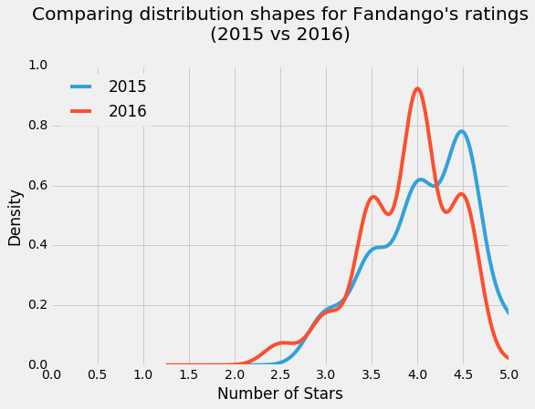
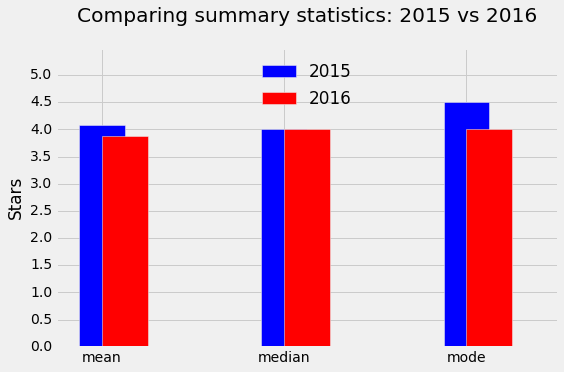

# Is Fandango Still Inflating Ratings?

In this project, I will use Python to help determine if Fandango still inflates their movie ratings. In 2015, [538](https://fivethirtyeight.com/features/fandango-movies-ratings/) showed that movie ratings on Fandango were higher than ratings on other sites. Fandango promised to fix this, and I wish to see if this fix occurred. 

## Importing the Data

We will work with two data sets for this project. First, we will use 538's [original data set](https://github.com/fivethirtyeight/data/tree/master/fandango) and then compare that with movies that [debuted in 2016 and 2017](https://github.com/mircealex/Movie_ratings_2016_17). 


```python
import pandas as pd

previous = pd.read_csv('fandango_score_comparison.csv')
after = pd.read_csv('movie_ratings_16_17.csv')

previous.head(3)
```


<div>
<style scoped>
    .dataframe tbody tr th:only-of-type {
        vertical-align: middle;
    }

    .dataframe tbody tr th {
        vertical-align: top;
    }

    .dataframe thead th {
        text-align: right;
    }
</style>
<table border="1" class="dataframe">
  <thead>
    <tr style="text-align: right;">
      <th></th>
      <th>FILM</th>
      <th>RottenTomatoes</th>
      <th>RottenTomatoes_User</th>
      <th>Metacritic</th>
      <th>Metacritic_User</th>
      <th>IMDB</th>
      <th>Fandango_Stars</th>
      <th>Fandango_Ratingvalue</th>
      <th>RT_norm</th>
      <th>RT_user_norm</th>
      <th>...</th>
      <th>IMDB_norm</th>
      <th>RT_norm_round</th>
      <th>RT_user_norm_round</th>
      <th>Metacritic_norm_round</th>
      <th>Metacritic_user_norm_round</th>
      <th>IMDB_norm_round</th>
      <th>Metacritic_user_vote_count</th>
      <th>IMDB_user_vote_count</th>
      <th>Fandango_votes</th>
      <th>Fandango_Difference</th>
    </tr>
  </thead>
  <tbody>
    <tr>
      <th>0</th>
      <td>Avengers: Age of Ultron (2015)</td>
      <td>74</td>
      <td>86</td>
      <td>66</td>
      <td>7.1</td>
      <td>7.8</td>
      <td>5.0</td>
      <td>4.5</td>
      <td>3.70</td>
      <td>4.3</td>
      <td>...</td>
      <td>3.90</td>
      <td>3.5</td>
      <td>4.5</td>
      <td>3.5</td>
      <td>3.5</td>
      <td>4.0</td>
      <td>1330</td>
      <td>271107</td>
      <td>14846</td>
      <td>0.5</td>
    </tr>
    <tr>
      <th>1</th>
      <td>Cinderella (2015)</td>
      <td>85</td>
      <td>80</td>
      <td>67</td>
      <td>7.5</td>
      <td>7.1</td>
      <td>5.0</td>
      <td>4.5</td>
      <td>4.25</td>
      <td>4.0</td>
      <td>...</td>
      <td>3.55</td>
      <td>4.5</td>
      <td>4.0</td>
      <td>3.5</td>
      <td>4.0</td>
      <td>3.5</td>
      <td>249</td>
      <td>65709</td>
      <td>12640</td>
      <td>0.5</td>
    </tr>
    <tr>
      <th>2</th>
      <td>Ant-Man (2015)</td>
      <td>80</td>
      <td>90</td>
      <td>64</td>
      <td>8.1</td>
      <td>7.8</td>
      <td>5.0</td>
      <td>4.5</td>
      <td>4.00</td>
      <td>4.5</td>
      <td>...</td>
      <td>3.90</td>
      <td>4.0</td>
      <td>4.5</td>
      <td>3.0</td>
      <td>4.0</td>
      <td>4.0</td>
      <td>627</td>
      <td>103660</td>
      <td>12055</td>
      <td>0.5</td>
    </tr>
  </tbody>
</table>
<p>3 rows × 22 columns</p>
</div>


```python
fandango_previous = previous[['FILM', 'Fandango_Stars', 'Fandango_Ratingvalue', 'Fandango_votes',
                             'Fandango_Difference']].copy()
fandango_after = after[['movie', 'year', 'fandango']].copy()

fandango_previous.head(3)
```


<div>
<style scoped>
    .dataframe tbody tr th:only-of-type {
        vertical-align: middle;
    }

    .dataframe tbody tr th {
        vertical-align: top;
    }

    .dataframe thead th {
        text-align: right;
    }
</style>
<table border="1" class="dataframe">
  <thead>
    <tr style="text-align: right;">
      <th></th>
      <th>FILM</th>
      <th>Fandango_Stars</th>
      <th>Fandango_Ratingvalue</th>
      <th>Fandango_votes</th>
      <th>Fandango_Difference</th>
    </tr>
  </thead>
  <tbody>
    <tr>
      <th>0</th>
      <td>Avengers: Age of Ultron (2015)</td>
      <td>5.0</td>
      <td>4.5</td>
      <td>14846</td>
      <td>0.5</td>
    </tr>
    <tr>
      <th>1</th>
      <td>Cinderella (2015)</td>
      <td>5.0</td>
      <td>4.5</td>
      <td>12640</td>
      <td>0.5</td>
    </tr>
    <tr>
      <th>2</th>
      <td>Ant-Man (2015)</td>
      <td>5.0</td>
      <td>4.5</td>
      <td>12055</td>
      <td>0.5</td>
    </tr>
  </tbody>
</table>
</div>


In the code above, I isolated the columns that offer information about Fandango's ratings. 

For the new data set, I did the same. 


```python
fandango_after.head(3)
```


<div>
<style scoped>
    .dataframe tbody tr th:only-of-type {
        vertical-align: middle;
    }

    .dataframe tbody tr th {
        vertical-align: top;
    }

    .dataframe thead th {
        text-align: right;
    }
</style>
<table border="1" class="dataframe">
  <thead>
    <tr style="text-align: right;">
      <th></th>
      <th>movie</th>
      <th>year</th>
      <th>fandango</th>
    </tr>
  </thead>
  <tbody>
    <tr>
      <th>0</th>
      <td>10 Cloverfield Lane</td>
      <td>2016</td>
      <td>3.5</td>
    </tr>
    <tr>
      <th>1</th>
      <td>13 Hours</td>
      <td>2016</td>
      <td>4.5</td>
    </tr>
    <tr>
      <th>2</th>
      <td>A Cure for Wellness</td>
      <td>2016</td>
      <td>3.0</td>
    </tr>
  </tbody>
</table>
</div>


Again, I wish to know whether the movies after 2015 are still inflated. I will take two samples: before 2016 and during/after 2016. 

However, after reading the README documents from each data set, each set was sampled with different strategies, so a direct comparision between the two would be unwise as the sampling processes were not random. 

So, I have two choices: I can either collect new data, or change the goal of my analysis. I will choose the latter. 

## New Goal

I want to know whether there is any difference in Fandango ratings in 2015 vs 2016 for popular movies only. 

I will define a movie as "popular" if it has at least 30 fan ratings. 

Because of the limitations of the data, I will have to manually determine if the movies in the new data set are popular. Rather than checking every film, I will take a sample of the data set and inspect Fandango's website. 


```python
fandango_after.sample(10, random_state = 1)
```


<div>
<style scoped>
    .dataframe tbody tr th:only-of-type {
        vertical-align: middle;
    }

    .dataframe tbody tr th {
        vertical-align: top;
    }

    .dataframe thead th {
        text-align: right;
    }
</style>
<table border="1" class="dataframe">
  <thead>
    <tr style="text-align: right;">
      <th></th>
      <th>movie</th>
      <th>year</th>
      <th>fandango</th>
    </tr>
  </thead>
  <tbody>
    <tr>
      <th>108</th>
      <td>Mechanic: Resurrection</td>
      <td>2016</td>
      <td>4.0</td>
    </tr>
    <tr>
      <th>206</th>
      <td>Warcraft</td>
      <td>2016</td>
      <td>4.0</td>
    </tr>
    <tr>
      <th>106</th>
      <td>Max Steel</td>
      <td>2016</td>
      <td>3.5</td>
    </tr>
    <tr>
      <th>107</th>
      <td>Me Before You</td>
      <td>2016</td>
      <td>4.5</td>
    </tr>
    <tr>
      <th>51</th>
      <td>Fantastic Beasts and Where to Find Them</td>
      <td>2016</td>
      <td>4.5</td>
    </tr>
    <tr>
      <th>33</th>
      <td>Cell</td>
      <td>2016</td>
      <td>3.0</td>
    </tr>
    <tr>
      <th>59</th>
      <td>Genius</td>
      <td>2016</td>
      <td>3.5</td>
    </tr>
    <tr>
      <th>152</th>
      <td>Sully</td>
      <td>2016</td>
      <td>4.5</td>
    </tr>
    <tr>
      <th>4</th>
      <td>A Hologram for the King</td>
      <td>2016</td>
      <td>3.0</td>
    </tr>
    <tr>
      <th>31</th>
      <td>Captain America: Civil War</td>
      <td>2016</td>
      <td>4.5</td>
    </tr>
  </tbody>
</table>
</div>


After checking each film in the sample above on Fandango's website, the only film with less than 30 ratings was "Cell". As 90% of the movies were popular, I will continue on with my analysis. 

I will now isolate the two data sets: the first data set will be popular movies released in 2016, while the second data set will be popular movies released in 2016. 


```python
fandango_previous['Year'] = fandango_previous['FILM'].str[-5:-1]
fandango_2015 = fandango_previous[fandango_previous['Year'] == '2015'].copy()
print(fandango_2015["Year"].value_counts())
print('/n')
fandango_2016 = fandango_after[fandango_after['year'] == 2016].copy()
print(fandango_2016["year"].value_counts())
```

    2015    129
    Name: Year, dtype: int64
    /n
    2016    191
    Name: year, dtype: int64


## Comparing the distributions

I will now create two density plots of the distributions to begin visualization. 


```python
import matplotlib.pyplot as plt
from numpy import arange
%matplotlib inline
plt.style.use('fivethirtyeight')


fandango_2015['Fandango_Stars'].plot.kde(label = '2015', legend = True, figsize = (8,5.5))
fandango_2016['fandango'].plot.kde(label = '2016', legend = True)

plt.title("Comparing distribution shapes for Fandango's ratings\n(2015 vs 2016)",
          y = 1.07)
plt.xlabel('Number of Stars')
plt.xlim(0,5)
plt.xticks(arange(0,5.1,.5))
plt.show()
```





We can see that the 2015 data is more left-skewed than the 2016 data. This provides evidence that Fandango did indeed adjust their ratings after the 538 article was published. 

The frequency tables below show the same effect. 


```python
fandango_2015['Fandango_Stars'].value_counts(normalize = True).sort_index()
## 2015 data
```


    3.0    0.085271
    3.5    0.178295
    4.0    0.286822
    4.5    0.379845
    5.0    0.069767
    Name: Fandango_Stars, dtype: float64


```python
fandango_2016['fandango'].value_counts(normalize = True).sort_index()
## 2016 data
```


    2.5    0.031414
    3.0    0.073298
    3.5    0.240838
    4.0    0.403141
    4.5    0.246073
    5.0    0.005236
    Name: fandango, dtype: float64


We can also see this difference when we compute the mean, median, and mode for both sets of data. 


```python
mean_2015 = fandango_2015["Fandango_Stars"].mean()
median_2015 = fandango_2015["Fandango_Stars"].median()
mode_2015 = fandango_2015["Fandango_Stars"].mode()[0]

mean_2016 = fandango_2016["fandango"].mean()
median_2016 = fandango_2016["fandango"].median()
mode_2016 = fandango_2016["fandango"].mode()[0]

summary = pd.DataFrame()
summary['2015'] = [mean_2015, median_2015, mode_2015]
summary['2016'] = [mean_2016, median_2016, mode_2016]
summary.index = ['mean', 'median', 'mode']
summary
```


<div>
<style scoped>
    .dataframe tbody tr th:only-of-type {
        vertical-align: middle;
    }

    .dataframe tbody tr th {
        vertical-align: top;
    }

    .dataframe thead th {
        text-align: right;
    }
</style>
<table border="1" class="dataframe">
  <thead>
    <tr style="text-align: right;">
      <th></th>
      <th>2015</th>
      <th>2016</th>
    </tr>
  </thead>
  <tbody>
    <tr>
      <th>mean</th>
      <td>4.085271</td>
      <td>3.887435</td>
    </tr>
    <tr>
      <th>median</th>
      <td>4.000000</td>
      <td>4.000000</td>
    </tr>
    <tr>
      <th>mode</th>
      <td>4.500000</td>
      <td>4.000000</td>
    </tr>
  </tbody>
</table>
</div>


```python
plt.style.use('fivethirtyeight')
summary['2015'].plot.bar(color = '#0000FF', align = 'center', label = '2015', width = .25)
summary['2016'].plot.bar(color = '#FF0000', align = 'edge', label = '2016', width = .25,
                         rot = 0, figsize = (8,5))

plt.title('Comparing summary statistics: 2015 vs 2016', y = 1.07)
plt.ylim(0,5.5)
plt.yticks(arange(0,5.1,.5))
plt.ylabel('Stars')
plt.legend(framealpha = 0, loc = 'upper center')
plt.show()
```




