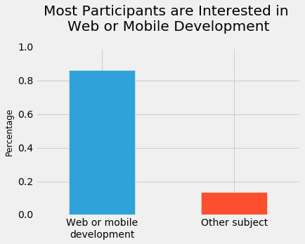
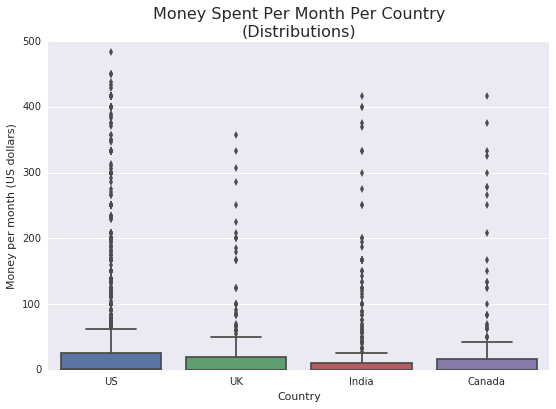

# Find the Best Markets For A E-Learning Product

In this project, I will use Python to help determine the best markets for e-learning, specializing in programming. 

## Understanding the Data

[Free Code Camp](https://www.freecodecamp.org/news/we-asked-20-000-people-who-they-are-and-how-theyre-learning-to-code-fff5d668969/) provided a survey in 2017 regarding interests of new coders. Their data can be found [here](https://github.com/freeCodeCamp/2017-new-coder-survey). 


```python
import pandas as pd

fcc = pd.read_csv('https://raw.githubusercontent.com/freeCodeCamp/2017-new-coder-survey/master/clean-data/2017-fCC-New-Coders-Survey-Data.csv', low_memory = 0)
fcc.shape
```


    (18175, 136)


```python
fcc.head()
```


<div>
<style scoped>
    .dataframe tbody tr th:only-of-type {
        vertical-align: middle;
    }

    .dataframe tbody tr th {
        vertical-align: top;
    }

    .dataframe thead th {
        text-align: right;
    }
</style>
<table border="1" class="dataframe">
  <thead>
    <tr style="text-align: right;">
      <th></th>
      <th>Age</th>
      <th>AttendedBootcamp</th>
      <th>BootcampFinish</th>
      <th>BootcampLoanYesNo</th>
      <th>BootcampName</th>
      <th>BootcampRecommend</th>
      <th>ChildrenNumber</th>
      <th>CityPopulation</th>
      <th>CodeEventConferences</th>
      <th>CodeEventDjangoGirls</th>
      <th>...</th>
      <th>YouTubeFCC</th>
      <th>YouTubeFunFunFunction</th>
      <th>YouTubeGoogleDev</th>
      <th>YouTubeLearnCode</th>
      <th>YouTubeLevelUpTuts</th>
      <th>YouTubeMIT</th>
      <th>YouTubeMozillaHacks</th>
      <th>YouTubeOther</th>
      <th>YouTubeSimplilearn</th>
      <th>YouTubeTheNewBoston</th>
    </tr>
  </thead>
  <tbody>
    <tr>
      <th>0</th>
      <td>27.0</td>
      <td>0.0</td>
      <td>NaN</td>
      <td>NaN</td>
      <td>NaN</td>
      <td>NaN</td>
      <td>NaN</td>
      <td>more than 1 million</td>
      <td>NaN</td>
      <td>NaN</td>
      <td>...</td>
      <td>NaN</td>
      <td>NaN</td>
      <td>NaN</td>
      <td>NaN</td>
      <td>NaN</td>
      <td>NaN</td>
      <td>NaN</td>
      <td>NaN</td>
      <td>NaN</td>
      <td>NaN</td>
    </tr>
    <tr>
      <th>1</th>
      <td>34.0</td>
      <td>0.0</td>
      <td>NaN</td>
      <td>NaN</td>
      <td>NaN</td>
      <td>NaN</td>
      <td>NaN</td>
      <td>less than 100,000</td>
      <td>NaN</td>
      <td>NaN</td>
      <td>...</td>
      <td>1.0</td>
      <td>NaN</td>
      <td>NaN</td>
      <td>NaN</td>
      <td>NaN</td>
      <td>NaN</td>
      <td>NaN</td>
      <td>NaN</td>
      <td>NaN</td>
      <td>NaN</td>
    </tr>
    <tr>
      <th>2</th>
      <td>21.0</td>
      <td>0.0</td>
      <td>NaN</td>
      <td>NaN</td>
      <td>NaN</td>
      <td>NaN</td>
      <td>NaN</td>
      <td>more than 1 million</td>
      <td>NaN</td>
      <td>NaN</td>
      <td>...</td>
      <td>NaN</td>
      <td>NaN</td>
      <td>NaN</td>
      <td>1.0</td>
      <td>1.0</td>
      <td>NaN</td>
      <td>NaN</td>
      <td>NaN</td>
      <td>NaN</td>
      <td>NaN</td>
    </tr>
    <tr>
      <th>3</th>
      <td>26.0</td>
      <td>0.0</td>
      <td>NaN</td>
      <td>NaN</td>
      <td>NaN</td>
      <td>NaN</td>
      <td>NaN</td>
      <td>between 100,000 and 1 million</td>
      <td>NaN</td>
      <td>NaN</td>
      <td>...</td>
      <td>1.0</td>
      <td>1.0</td>
      <td>NaN</td>
      <td>NaN</td>
      <td>1.0</td>
      <td>NaN</td>
      <td>NaN</td>
      <td>NaN</td>
      <td>NaN</td>
      <td>NaN</td>
    </tr>
    <tr>
      <th>4</th>
      <td>20.0</td>
      <td>0.0</td>
      <td>NaN</td>
      <td>NaN</td>
      <td>NaN</td>
      <td>NaN</td>
      <td>NaN</td>
      <td>between 100,000 and 1 million</td>
      <td>NaN</td>
      <td>NaN</td>
      <td>...</td>
      <td>NaN</td>
      <td>NaN</td>
      <td>NaN</td>
      <td>NaN</td>
      <td>NaN</td>
      <td>NaN</td>
      <td>NaN</td>
      <td>NaN</td>
      <td>NaN</td>
      <td>NaN</td>
    </tr>
  </tbody>
</table>
<p>5 rows × 136 columns</p>
</div>


## Sample Representivity

I first wish to see if this survey is representative of the people I wish to capture: people interested in beginning to code. The HobRoleInterest column would be helpeful in determining this. I will explore this column further. 


```python
fcc["JobRoleInterest"].value_counts(normalize = True).sort_values(ascending = False)
```


    Full-Stack Web Developer                                                                                                                                                                                                                                  0.117706
      Front-End Web Developer                                                                                                                                                                                                                                 0.064359
      Data Scientist                                                                                                                                                                                                                                          0.021739
    Back-End Web Developer                                                                                                                                                                                                                                    0.020309
      Mobile Developer                                                                                                                                                                                                                                        0.016733
    Game Developer                                                                                                                                                                                                                                            0.016304
    Information Security                                                                                                                                                                                                                                      0.013158
    Full-Stack Web Developer,   Front-End Web Developer                                                                                                                                                                                                       0.009153
      Front-End Web Developer, Full-Stack Web Developer                                                                                                                                                                                                       0.008009
      Product Manager                                                                                                                                                                                                                                         0.007866
    Data Engineer                                                                                                                                                                                                                                             0.007580
      User Experience Designer                                                                                                                                                                                                                                0.007437
      User Experience Designer,   Front-End Web Developer                                                                                                                                                                                                     0.006150
      Front-End Web Developer, Back-End Web Developer, Full-Stack Web Developer                                                                                                                                                                               0.005578
    Back-End Web Developer,   Front-End Web Developer, Full-Stack Web Developer                                                                                                                                                                               0.005149
      DevOps / SysAdmin                                                                                                                                                                                                                                       0.005149
    Back-End Web Developer, Full-Stack Web Developer,   Front-End Web Developer                                                                                                                                                                               0.005149
    Full-Stack Web Developer,   Front-End Web Developer, Back-End Web Developer                                                                                                                                                                               0.004434
      Front-End Web Developer, Full-Stack Web Developer, Back-End Web Developer                                                                                                                                                                               0.004291
    Full-Stack Web Developer,   Mobile Developer                                                                                                                                                                                                              0.004148
      Front-End Web Developer,   User Experience Designer                                                                                                                                                                                                     0.004148
    Back-End Web Developer, Full-Stack Web Developer                                                                                                                                                                                                          0.003862
    Full-Stack Web Developer, Back-End Web Developer                                                                                                                                                                                                          0.003719
    Back-End Web Developer,   Front-End Web Developer                                                                                                                                                                                                         0.002860
    Data Engineer,   Data Scientist                                                                                                                                                                                                                           0.002717
    Full-Stack Web Developer, Back-End Web Developer,   Front-End Web Developer                                                                                                                                                                               0.002717
      Front-End Web Developer,   Mobile Developer                                                                                                                                                                                                             0.002574
    Full-Stack Web Developer,   Data Scientist                                                                                                                                                                                                                0.002431
      Data Scientist, Data Engineer                                                                                                                                                                                                                           0.002288
      Mobile Developer, Game Developer                                                                                                                                                                                                                        0.002288
                                                                                                                                                                                                                                                                ...   
      User Experience Designer, Game Developer,   Data Scientist, Full-Stack Web Developer                                                                                                                                                                    0.000143
      Quality Assurance Engineer, Back-End Web Developer, Data Engineer,   Front-End Web Developer                                                                                                                                                            0.000143
      Front-End Web Developer, Data Engineer, Back-End Web Developer,   Quality Assurance Engineer                                                                                                                                                            0.000143
      Front-End Web Developer,   Mobile Developer,   User Experience Designer, Back-End Web Developer, Full-Stack Web Developer                                                                                                                               0.000143
    Data Engineer,   Data Scientist, Full-Stack Web Developer,   Quality Assurance Engineer,   Front-End Web Developer                                                                                                                                        0.000143
    College professor                                                                                                                                                                                                                                         0.000143
      Front-End Web Developer, Back-End Web Developer,   User Experience Designer, Full-Stack Web Developer,   Data Scientist                                                                                                                                 0.000143
      Front-End Web Developer, Data Engineer, Back-End Web Developer, Full-Stack Web Developer,   Mobile Developer                                                                                                                                            0.000143
      Product Manager,   Quality Assurance Engineer,   Front-End Web Developer,   Mobile Developer, Data Engineer, Information Security, Back-End Web Developer, Full-Stack Web Developer                                                                     0.000143
    Game Developer,   Data Scientist, Information Security,   DevOps / SysAdmin                                                                                                                                                                               0.000143
    Full-Stack Web Developer,   User Experience Designer, Game Developer,   Front-End Web Developer,   Mobile Developer                                                                                                                                       0.000143
    Full-Stack Web Developer,   Front-End Web Developer, Back-End Web Developer, Information Security,   Mobile Developer, Game Developer,   Product Manager,   User Experience Designer,   Quality Assurance Engineer, Data Engineer,   DevOps / SysAdmin    0.000143
      Mobile Developer, Full-Stack Web Developer, Information Security,   DevOps / SysAdmin                                                                                                                                                                   0.000143
      Front-End Web Developer,   User Experience Designer,   Product Manager, Back-End Web Developer, Information Security,   DevOps / SysAdmin, Full-Stack Web Developer, Data Engineer,   Data Scientist                                                    0.000143
      Data Scientist, Game Developer,   Mobile Developer,   User Experience Designer, Full-Stack Web Developer,   Front-End Web Developer, Back-End Web Developer                                                                                             0.000143
      User Experience Designer, Game Developer,   Mobile Developer, Full-Stack Web Developer                                                                                                                                                                  0.000143
      Front-End Web Developer,   Product Manager, Full-Stack Web Developer,   Data Scientist, Data Engineer                                                                                                                                                   0.000143
      Mobile Developer,   Front-End Web Developer, Full-Stack Web Developer, Back-End Web Developer,   User Experience Designer                                                                                                                               0.000143
      Mobile Developer, Data Engineer, Game Developer,   User Experience Designer,   Quality Assurance Engineer,   Front-End Web Developer                                                                                                                    0.000143
      Front-End Web Developer, Full-Stack Web Developer, Game Developer,   Quality Assurance Engineer                                                                                                                                                         0.000143
    Game Developer,   Data Scientist,   User Experience Designer                                                                                                                                                                                              0.000143
      DevOps / SysAdmin,   Data Scientist, Full-Stack Web Developer, Information Security                                                                                                                                                                     0.000143
      Data Scientist, Data Engineer, Back-End Web Developer, Information Security                                                                                                                                                                             0.000143
    Back-End Web Developer, Full-Stack Web Developer,   Mobile Developer,   Front-End Web Developer, Game Developer                                                                                                                                           0.000143
      User Experience Designer,   Mobile Developer, Information Security, Full-Stack Web Developer,   DevOps / SysAdmin,   Front-End Web Developer, Back-End Web Developer                                                                                    0.000143
    Back-End Web Developer, Game Developer,   User Experience Designer,   Data Scientist, Full-Stack Web Developer,   Mobile Developer                                                                                                                        0.000143
    Pharmacy tech                                                                                                                                                                                                                                             0.000143
    Full-Stack Web Developer,   Mobile Developer,   Product Manager,   User Experience Designer,   Front-End Web Developer                                                                                                                                    0.000143
      Quality Assurance Engineer,   Data Scientist,   Front-End Web Developer                                                                                                                                                                                 0.000143
      Front-End Web Developer, Game Developer, Data Engineer,   Data Scientist, Back-End Web Developer,   Mobile Developer                                                                                                                                    0.000143
    Name: JobRoleInterest, Length: 3213, dtype: float64


It looks like the survey participants can be interested in more than one role. The most popular roles are web developers and data scientists. 

For this project, I want to focus on web and mobile development. So, I wish to know what percentage of survey respondents are interested in at least one of these two subjects. 


```python
# Frequency table
interests_no_nulls = fcc['JobRoleInterest'].dropna()
web_or_mobile = interests_no_nulls.str.contains(
    'Web Developer|Mobile Developer') # returns an array of booleans
freq_table = web_or_mobile.value_counts(normalize = True)
print(freq_table)

# Graph for the frequency table above
%matplotlib inline
import matplotlib.pyplot as plt
plt.style.use('fivethirtyeight')

freq_table.plot.bar()
plt.title('Most Participants are Interested in \nWeb or Mobile Development',
          y = 1.08) # y pads the title upward
plt.ylabel('Percentage', fontsize = 12)
plt.xticks([0,1],['Web or mobile\ndevelopment', 'Other subject'],
           rotation = 0) # the initial xtick labels were True and False
plt.ylim([0,1])
plt.show()
```

    True     0.862414
    False    0.137586
    Name: JobRoleInterest, dtype: float64





It looks like roughly 86% of survey participants were interested in web or mobile development. 

## Finding Locations

I now wish to find where these new coders are located, and the densities of new coders in different locations. To accomplish this, I will look at the column CountryLive. 


```python
fcc_good = fcc[fcc['JobRoleInterest'].notnull()].copy()
fcc_good["CountryLive"].value_counts(normalize = True).sort_values(ascending = False).head()
```


    United States of America    0.457005
    India                       0.077216
    United Kingdom              0.046066
    Canada                      0.038023
    Poland                      0.019158
    Name: CountryLive, dtype: float64


It looks like the United States is the largest market for this survey. 

## Money Spent

I now wish to see how much money a new coder would actually spend on learning. The MoneyForLearning column will be helpful for this. I will narrow my analysis for only the USA, India, UK, and Canada as they are the in the top four countries of my previoius table and all have a large percentage of the population who speak English. 


```python
fcc_good['MonthsProgramming'].replace(0,1, inplace = True)
#replacing zeroes with ones to avoid divide by zero error

fcc_good['money_per_month'] = fcc_good['MoneyForLearning'] / fcc_good['MonthsProgramming']
fcc_good['money_per_month'].isnull().sum()
```


    675


```python
# Keep only the rows with non-nulls in the `money_per_month` column 
fcc_good = fcc_good[fcc_good['money_per_month'].notnull()]
```


```python
fcc_good = fcc_good[fcc_good["CountryLive"].notnull()]
```


```python
countries_mean = fcc_good.groupby('CountryLive').mean()
countries_mean['money_per_month'][['United States of America',
                            'India', 'United Kingdom',
                            'Canada']]
```


    CountryLive
    United States of America    227.997996
    India                       135.100982
    United Kingdom               45.534443
    Canada                      113.510961
    Name: money_per_month, dtype: float64


It looks like those living in the United States are willing to pay significantly more per month to learn how to code. I will inspect this data further with box plots. 


```python
# Isolate only the countries of interest
only_4 = fcc_good[fcc_good['CountryLive'].str.contains(
    'United States of America|India|United Kingdom|Canada')]

# Box plots to visualize distributions
import seaborn as sns
sns.boxplot(y = 'money_per_month', x = 'CountryLive',
            data = only_4)
plt.title('Money Spent Per Month Per Country\n(Distributions)',
         fontsize = 16)
plt.ylabel('Money per month (US dollars)')
plt.xlabel('Country')
plt.xticks(range(4), ['US', 'UK', 'India', 'Canada']) # avoids tick labels overlap
plt.show()
```

    /dataquest/system/env/python3/lib/python3.4/site-packages/seaborn/categorical.py:454: FutureWarning: remove_na is deprecated and is a private function. Do not use.
      box_data = remove_na(group_data)


I see some extreme outliers for each country. I now wish to eliminate these. I will eliminate all data greater than $500 per month. 


```python
only_4_good = only_4[only_4["money_per_month"] < 500]

sns.boxplot(y = 'money_per_month', x = 'CountryLive',
            data = only_4_good)
plt.title('Money Spent Per Month Per Country\n(Distributions)',
         fontsize = 16)
plt.ylabel('Money per month (US dollars)')
plt.xlabel('Country')
plt.xticks(range(4), ['US', 'UK', 'India', 'Canada']) # avoids tick labels overlap
plt.show()
```

    /dataquest/system/env/python3/lib/python3.4/site-packages/seaborn/categorical.py:454: FutureWarning: remove_na is deprecated and is a private function. Do not use.
      box_data = remove_na(group_data)





```python
only_4_good.groupby('CountryLive').mean()['money_per_month']
```


    CountryLive
    Canada                      25.750435
    India                       23.656237
    United Kingdom              25.245838
    United States of America    33.875842
    Name: money_per_month, dtype: float64


With some outliers removes, we see that most customers in these four countries would be willing to pay roughly $25 per month to learn how to code. 
