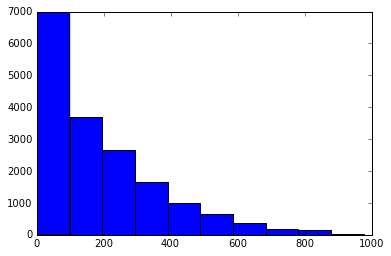

# Predicting Bike Rentals Using Random Forests

In this project, I will predict the total number of bike rentals in a given hour. I will use the [bike sharing data from UC Irvine](https://archive.ics.uci.edu/ml/datasets/Bike+Sharing+Dataset) that includes information regarding bike rentals from Washington D.C.. 

# Exploring the Data


```python
import pandas as pd

bike_rentals = pd.read_csv("bike_rental_hour.csv")
print(bike_rentals.shape)
bike_rentals.head()
```

    (17379, 17)


<div>
<style scoped>
    .dataframe tbody tr th:only-of-type {
        vertical-align: middle;
    }

    .dataframe tbody tr th {
        vertical-align: top;
    }

    .dataframe thead th {
        text-align: right;
    }
</style>
<table border="1" class="dataframe">
  <thead>
    <tr style="text-align: right;">
      <th></th>
      <th>instant</th>
      <th>dteday</th>
      <th>season</th>
      <th>yr</th>
      <th>mnth</th>
      <th>hr</th>
      <th>holiday</th>
      <th>weekday</th>
      <th>workingday</th>
      <th>weathersit</th>
      <th>temp</th>
      <th>atemp</th>
      <th>hum</th>
      <th>windspeed</th>
      <th>casual</th>
      <th>registered</th>
      <th>cnt</th>
    </tr>
  </thead>
  <tbody>
    <tr>
      <th>0</th>
      <td>1</td>
      <td>2011-01-01</td>
      <td>1</td>
      <td>0</td>
      <td>1</td>
      <td>0</td>
      <td>0</td>
      <td>6</td>
      <td>0</td>
      <td>1</td>
      <td>0.24</td>
      <td>0.2879</td>
      <td>0.81</td>
      <td>0.0</td>
      <td>3</td>
      <td>13</td>
      <td>16</td>
    </tr>
    <tr>
      <th>1</th>
      <td>2</td>
      <td>2011-01-01</td>
      <td>1</td>
      <td>0</td>
      <td>1</td>
      <td>1</td>
      <td>0</td>
      <td>6</td>
      <td>0</td>
      <td>1</td>
      <td>0.22</td>
      <td>0.2727</td>
      <td>0.80</td>
      <td>0.0</td>
      <td>8</td>
      <td>32</td>
      <td>40</td>
    </tr>
    <tr>
      <th>2</th>
      <td>3</td>
      <td>2011-01-01</td>
      <td>1</td>
      <td>0</td>
      <td>1</td>
      <td>2</td>
      <td>0</td>
      <td>6</td>
      <td>0</td>
      <td>1</td>
      <td>0.22</td>
      <td>0.2727</td>
      <td>0.80</td>
      <td>0.0</td>
      <td>5</td>
      <td>27</td>
      <td>32</td>
    </tr>
    <tr>
      <th>3</th>
      <td>4</td>
      <td>2011-01-01</td>
      <td>1</td>
      <td>0</td>
      <td>1</td>
      <td>3</td>
      <td>0</td>
      <td>6</td>
      <td>0</td>
      <td>1</td>
      <td>0.24</td>
      <td>0.2879</td>
      <td>0.75</td>
      <td>0.0</td>
      <td>3</td>
      <td>10</td>
      <td>13</td>
    </tr>
    <tr>
      <th>4</th>
      <td>5</td>
      <td>2011-01-01</td>
      <td>1</td>
      <td>0</td>
      <td>1</td>
      <td>4</td>
      <td>0</td>
      <td>6</td>
      <td>0</td>
      <td>1</td>
      <td>0.24</td>
      <td>0.2879</td>
      <td>0.75</td>
      <td>0.0</td>
      <td>0</td>
      <td>1</td>
      <td>1</td>
    </tr>
  </tbody>
</table>
</div>


cnt describes the total number of bikes rented, and this is what I will want to predict. Let's first visualize this data


```python
%matplotlib inline

import matplotlib.pyplot as plt

plt.hist(bike_rentals["cnt"])
```


    (array([6972., 3705., 2659., 1660.,  987.,  663.,  369.,  188.,  139.,
              37.]),
     array([  1. ,  98.6, 196.2, 293.8, 391.4, 489. , 586.6, 684.2, 781.8,
            879.4, 977. ]),
     <a list of 10 Patch objects>)





I will now explore how each column is correlated with cnt


```python
bike_rentals.corr()["cnt"]
```


    instant       0.278379
    season        0.178056
    yr            0.250495
    mnth          0.120638
    hr            0.394071
    holiday      -0.030927
    weekday       0.026900
    workingday    0.030284
    weathersit   -0.142426
    temp          0.404772
    atemp         0.400929
    hum          -0.322911
    windspeed     0.093234
    casual        0.694564
    registered    0.972151
    cnt           1.000000
    Name: cnt, dtype: float64


It looks like registered and casual are highly correlated with cnt, which makes sense since cnt is the sum of registered and casual. 

## Introducing Features

Before applying machine learning models, I will calculate features. In particular, I will introduce some order in the the time of day by creating a new column with labels for morning, afternoon, evening, and night. This will bundle similar times together, enabling the model to make better predictions. 


```python
def assign_label(hour):
    if hour >=0 and hour < 6:
        return 4 #night
    elif hour >=6 and hour < 12:
        return 1 #morning
    elif hour >= 12 and hour < 18:
        return 2 #afternoon
    elif hour >= 18 and hour <=24:
        return 3 #evening
    
bike_rentals["time_label"] = bike_rentals["hr"].apply(assign_label)

bike_rentals.head()
```


<div>
<style scoped>
    .dataframe tbody tr th:only-of-type {
        vertical-align: middle;
    }

    .dataframe tbody tr th {
        vertical-align: top;
    }

    .dataframe thead th {
        text-align: right;
    }
</style>
<table border="1" class="dataframe">
  <thead>
    <tr style="text-align: right;">
      <th></th>
      <th>instant</th>
      <th>dteday</th>
      <th>season</th>
      <th>yr</th>
      <th>mnth</th>
      <th>hr</th>
      <th>holiday</th>
      <th>weekday</th>
      <th>workingday</th>
      <th>weathersit</th>
      <th>temp</th>
      <th>atemp</th>
      <th>hum</th>
      <th>windspeed</th>
      <th>casual</th>
      <th>registered</th>
      <th>cnt</th>
      <th>time_label</th>
    </tr>
  </thead>
  <tbody>
    <tr>
      <th>0</th>
      <td>1</td>
      <td>2011-01-01</td>
      <td>1</td>
      <td>0</td>
      <td>1</td>
      <td>0</td>
      <td>0</td>
      <td>6</td>
      <td>0</td>
      <td>1</td>
      <td>0.24</td>
      <td>0.2879</td>
      <td>0.81</td>
      <td>0.0</td>
      <td>3</td>
      <td>13</td>
      <td>16</td>
      <td>4</td>
    </tr>
    <tr>
      <th>1</th>
      <td>2</td>
      <td>2011-01-01</td>
      <td>1</td>
      <td>0</td>
      <td>1</td>
      <td>1</td>
      <td>0</td>
      <td>6</td>
      <td>0</td>
      <td>1</td>
      <td>0.22</td>
      <td>0.2727</td>
      <td>0.80</td>
      <td>0.0</td>
      <td>8</td>
      <td>32</td>
      <td>40</td>
      <td>4</td>
    </tr>
    <tr>
      <th>2</th>
      <td>3</td>
      <td>2011-01-01</td>
      <td>1</td>
      <td>0</td>
      <td>1</td>
      <td>2</td>
      <td>0</td>
      <td>6</td>
      <td>0</td>
      <td>1</td>
      <td>0.22</td>
      <td>0.2727</td>
      <td>0.80</td>
      <td>0.0</td>
      <td>5</td>
      <td>27</td>
      <td>32</td>
      <td>4</td>
    </tr>
    <tr>
      <th>3</th>
      <td>4</td>
      <td>2011-01-01</td>
      <td>1</td>
      <td>0</td>
      <td>1</td>
      <td>3</td>
      <td>0</td>
      <td>6</td>
      <td>0</td>
      <td>1</td>
      <td>0.24</td>
      <td>0.2879</td>
      <td>0.75</td>
      <td>0.0</td>
      <td>3</td>
      <td>10</td>
      <td>13</td>
      <td>4</td>
    </tr>
    <tr>
      <th>4</th>
      <td>5</td>
      <td>2011-01-01</td>
      <td>1</td>
      <td>0</td>
      <td>1</td>
      <td>4</td>
      <td>0</td>
      <td>6</td>
      <td>0</td>
      <td>1</td>
      <td>0.24</td>
      <td>0.2879</td>
      <td>0.75</td>
      <td>0.0</td>
      <td>0</td>
      <td>1</td>
      <td>1</td>
      <td>4</td>
    </tr>
  </tbody>
</table>
</div>


## Splitting the Data into Training and Testing Sets

I will split the data into a training and testing set using a 80/20 split. I will use the mean square error metric to evaluate my error since our data is continuous. 


```python
train = bike_rentals.sample(frac=.8)
test = bike_rentals.loc[~bike_rentals.index.isin(train.index)]
```

## Applying Linear Regression to the Data

Again, I will ignore the sacual and registered columns because cnt is derived from them. 


```python
train_cols = list(train.columns.drop(['cnt', 'casual', 'dteday', 'registered']))
train_cols
```


    ['instant',
     'season',
     'yr',
     'mnth',
     'hr',
     'holiday',
     'weekday',
     'workingday',
     'weathersit',
     'temp',
     'atemp',
     'hum',
     'windspeed',
     'time_label']


```python
import numpy as np
from sklearn.linear_model import LinearRegression
from sklearn.metrics import mean_squared_error

reg = LinearRegression().fit(train[train_cols], train['cnt'])

test_predictions = reg.predict(test[train_cols])
test_mse = mean_squared_error(test_predictions, test['cnt'])

test_mse
```


    16965.691540414377


This error is very high. Based on our histogram above, this could be due by having a few very high counts. 

## Decision Tree Algorithm

After applying the decision tree alogrithm, I will compare its error with the error from linear regression. I expect the decision tree error to be better since decision trees tend to predict outcomes much more reliably than linear regression models. 


```python
from sklearn.tree import DecisionTreeRegressor

clf = DecisionTreeRegressor(random_state = 1, min_samples_leaf = 5)
clf.fit(train[train_cols], train['cnt'])
predictions = clf.predict(test[train_cols])

np.mean((predictions - test['cnt'])**2)
```


    2746.015098948489


The error is certainly better than the linear regression model

## Random Forest Algorithm

I will now apply the random forest algorithm, whish should improve on the decision tree algorithm


```python
from sklearn.ensemble import RandomForestRegressor
rfor = RandomForestRegressor(random_state=1, min_samples_leaf = 5)
rfor.fit(train[train_cols], train['cnt'])
predictions = rfor.predict(test[train_cols])

np.mean((predictions - test['cnt'])**2)
```


    1955.116579984549


The random forest algorithm has the smallest error. 
